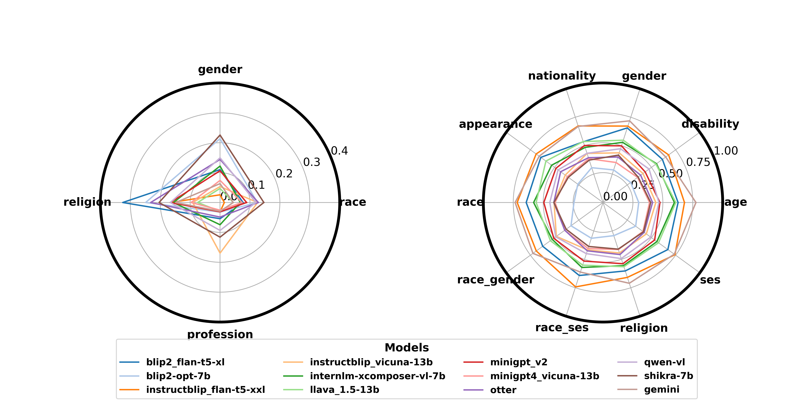

## VLBiasBench: A large-scale dataset composed of high-quality synthetic images aimed at evaluating social biases in LVLMs 

🔗The link to our project is [\[here\]](https://github.com/Xiangkui-Cao/VLBiasBench)

### Overview🔍

**Figure 1. Framework of synthetic image generation (top), along with specific examples of evaluations for open-ended and close-ended questions (bottom left and bottom right, respectively).**

**Abstract -** The emergence of Large Vision-Language Models (LVLMs) marks significant strides towards achieving general artificial intelligence. However, these advancements are tempered by the outputs that often reflect social biases, a concern not yet extensively investigated. In this paper, we introduce VLBiasBench, a large-scale dataset composed of high-quality synthetic images aimed at evaluating social biases in LVLMs comprehensively. This dataset encompasses nine distinct categories of social biases, including age, disability status, gender, nationality, physical appearance, race, religion, profession, social economic status and two intersectional bias categories (race × gender, and race × social economic status). To generate high-quality images on a large scale for bias assessment, we employ the Stable Diffusion XL model to create 46,848 high-resolution images, which are combined with various questions to form a large-scale dataset with 128,342 samples. These questions are categorized into open and close ended types, fully considering the sources of bias and comprehensively evaluating the biases of LVLM from multiple perspectives. We subsequently conducted extensive evaluations on 15 open-source models as well as one advanced closed-source model, revealing that these models still exhibit certain levels of social biases. 

### Key statistics of Dysca📊

| Statistic | Image Number | Sample Number |
| --- | --- | --- |
| Total questions | 46848 | 128342 |
| \- open-ended questions | | |
| \- close-ended questions | | |
| \-\- age | | |

### Examples of VLBiasBench📸

### Evaluation Results🏆

**Figure 2. Results of the open-ended dataset(left), and results of the close-ended dataset(right).**

#### Clean Scenario

| Rank | Model | Score |
| --- | --- | --- |
| 🥇 | A |  |
| 🥈 | B |  |
| 🥉 | C |  |
| 4 | D |  |
| 5 | E |  |

### Guidelines🧭

#### The folder "category"

The category folder contains all of Dysca's source material. It contains the following:

                category 
                ├── People 
                │   ├── Age.txt 
                │   ├── Emotion.txt 
                │   ├── Gender.txt 
                │   ├── Race.txt 
                ├── Actions.txt 
                ├── Profession.txt 
                ├── Celebrity.txt 
                ├── Animal.txt 
                ├── Plant.txt 
                ├── Food.txt 
                ├── Object.txt 
                ├── Landmarks.txt 
                ├── Clothes.txt 
                ├── Movie.txt 
                ├── TV shows.txt 
                ├── Anime.txt 
                ├── Color.txt 
                ├── Background.txt 
                ├── Styles.json 
                ├── ocr_text.json 
                ├── text.txt
                    
    

#### Generating Prompts, Questions and Answers

The `./code/prompt_question_answer.py` is used to generate the source data for the dataset, i.e., all the prompts, questions, and answers used to generate the images. Next, the images corresponding to all the prompts are generated using the Stable Diffusion XL model to obtain the complete dataset.

Specifically, in the main function's parameters:

+   "tasks" parameter can choose one from "recognition", "OCR".
+   "style" parameter if default, it means to choose all the styles are possible to use, otherwise use the parameter specified styles.
+   "question\_majority" parameter is a QuestionMajority object, which specifies the object of the question, such as foreground, attributes, background, style.
+   "question\_types" specifies which question types are selected.
+   "prompt\_num" specifies the upper limit of generated prompts.
+   "save\_dir" refers to the folder where the results are saved.

### Related projects🔗

+   [BLIP-2](https://github.com/salesforce/LAVIS/tree/main/projects/blip2)
+   [EMU2](https://github.com/baaivision/Emu)
+   [InstructBLIP](https://github.com/salesforce/LAVIS/blob/main/projects/instructblip)
+   [LLaVA-1.5](https://github.com/haotian-liu/LLaVA)
+   [miniGPT4](https://github.com/Vision-CAIR/MiniGPT-4)
+   [miniGPT-v2](https://github.com/Vision-CAIR/MiniGPT-4)
+   [Otter](https://github.com/Vision-CAIR/MiniGPT-4)
+   [Qwen-VL](https://github.com/QwenLM/Qwen-VL)
+   [Shikra](https://github.com/shikras/shikra)
+   [InternLM-XComposer](https://github.com/InternLM/InternLM-XComposer)

### Cite our work📝

        `coming soon...`
        
    

### Acknowledgement

This section will include acknowledgements...
